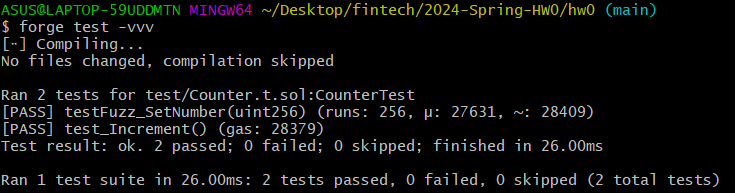

# 2024-Spring-HW0

All the detailed specified in Homework 0 documentation.

## Wallet Address
Please provide your MetaMask wallet address:
0x3106CC3821D4a1D5501a53b9c0aB4853aa890d79

## Local Testing
Please provide a screenshot of the `forge test -vvv` command running in your local environment.

## Contract Address
Please provide the contract address that you deployed on the Sepolia network.
0x4967438EC9eE61D2C4A3AC9149A24364E5847554

## Sepolia Etherscan
Paste the contract address into the Sepolia Etherscan and share the screenshot.
